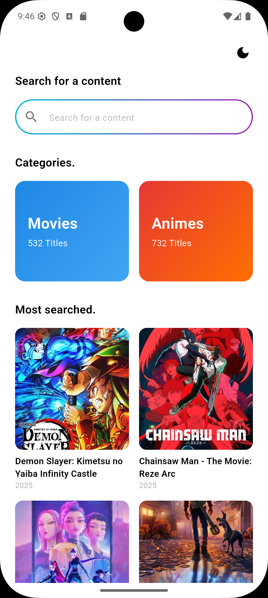
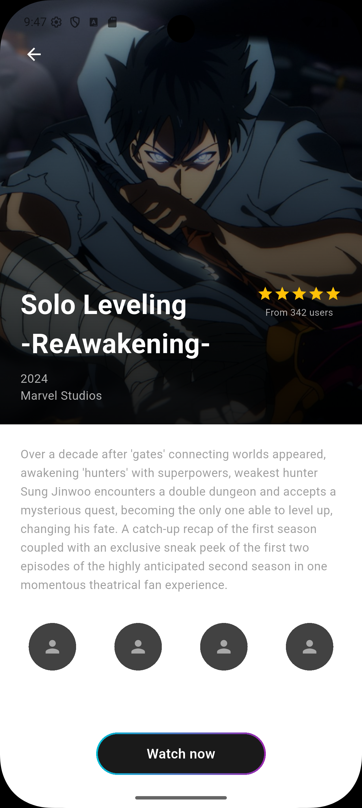
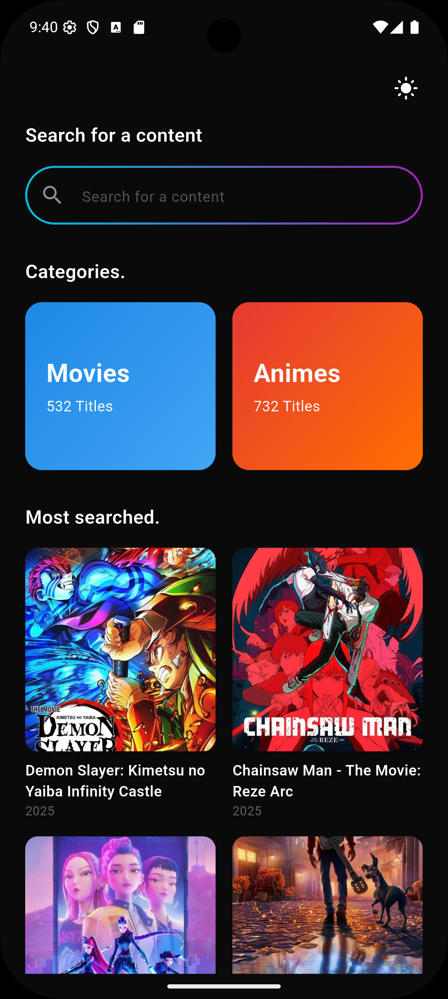
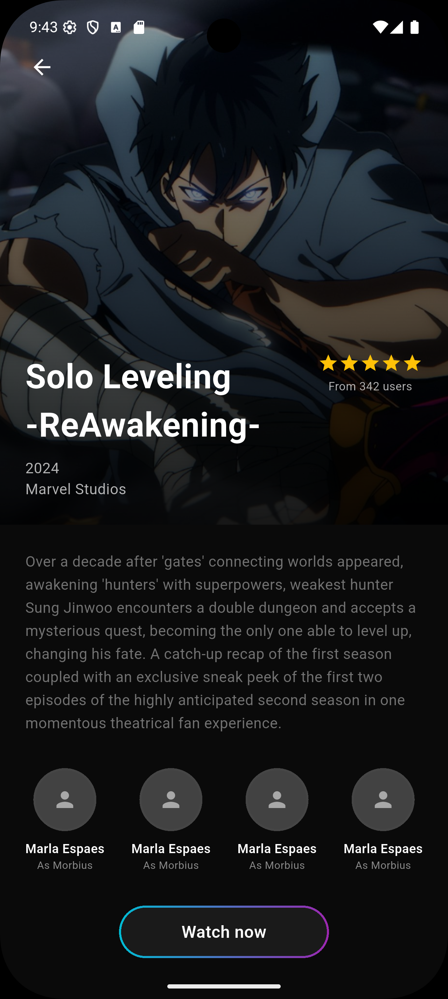

# Movie App

A modern Flutter movie discovery application built with Clean Architecture, featuring light/dark themes, pagination, caching, and CI/CD pipeline.

## Features

- **Browse Popular Movies**: Discover trending animated movies with infinite scroll pagination
- **Movie Details**: View comprehensive movie information including ratings, cast, and synopsis
- **Light/Dark Theme**: Seamless theme switching with beautiful gradient UI elements
- **Offline Support**: Smart caching system for offline browsing
- **Dev/Prod Flavors**: Separate development and production environments
- **CI/CD Pipeline**: Automated testing and builds with GitHub Actions

## Screenshots

| Onboarding | Home | Details |
|:---:|:---:|:---:|
|  |  |  |
| **Light Mode** | **Light Mode** | **Light Mode** |
|  |  |  |
| **Dark Mode** | **Dark Mode** | **Dark Mode** |

## Architecture

This project follows **Clean Architecture** principles with clear separation of concerns:

```
lib/
├── core/                   # Shared utilities and base classes
│   ├── error/             # Error handling
│   ├── network/           # API configuration
│   ├── theme/             # App theming
│   └── widgets/           # Reusable UI components
├── features/
│   ├── movies/
│   │   ├── data/         # Data sources & repositories implementation
│   │   ├── domain/       # Entities, repositories interfaces & use cases
│   │   └── presentation/ # UI (pages, widgets, cubits, states)
│   └── onboarding/
│       ├── domain/
│       └── presentation/
└── main.dart              # App entry point
```

### Layers

- **Domain Layer**: Pure Dart business logic (entities, use cases, repository interfaces)
- **Data Layer**: External data handling (API, cache, repository implementations)
- **Presentation Layer**: UI components (pages, widgets, state management with Bloc/Cubit)

## Tech Stack

- **Framework**: Flutter 3.24.5
- **State Management**: flutter_bloc / cubit
- **Networking**: dio + retrofit
- **Caching**: hive
- **Image Caching**: cached_network_image
- **Routing**: go_router
- **Functional Programming**: dartz
- **Testing**: flutter_test, mocktail, bloc_test
- **CI/CD**: GitHub Actions

## Getting Started

### Prerequisites

- Flutter SDK 3.24.5 or higher
- Dart SDK 3.5.4 or higher
- TMDB API Key (get one from [themoviedb.org](https://www.themoviedb.org/settings/api))

### Installation

1. Clone the repository:
```bash
git clone https://github.com/zicoovic/movie_app.git
cd movie_app
```

2. Install dependencies:
```bash
flutter pub get
```

3. Add your TMDB API key to `lib/core/network/api_constants.dart`:
```dart
static const String apiKey = 'YOUR_API_KEY_HERE';
```

4. Run the app:
```bash
# Development flavor
flutter run --flavor dev --dart-define=FLAVOR=dev

# Production flavor
flutter run --flavor prod --dart-define=FLAVOR=prod
```

## Testing

The project includes comprehensive unit tests for the domain and presentation layers.

Run all tests:
```bash
flutter test
```

Run tests with coverage:
```bash
flutter test --coverage
```

**Test Coverage:**
- ✅ GetPopularMovies UseCase (3 tests)
- ✅ MovieListCubit (4 tests)
- **Total**: 7 tests, 100% passing

## Flavors

The app supports two flavors for different environments:

- **Dev**: Development environment with debug features
  - App name: "Movie App Dev"
  - Package: `com.example.movie_app.dev`

- **Prod**: Production environment
  - App name: "Movie App"
  - Package: `com.example.movie_app`

### VS Code Configuration

Use the built-in run configurations:
1. Open Run & Debug panel (Ctrl+Shift+D)
2. Select "Dev Flavor" or "Prod Flavor"
3. Press F5 to run

## CI/CD Pipeline

GitHub Actions automatically runs on every push/PR to `main` or `develop`:

1. ✅ Code formatting check
2. ✅ Static analysis (flutter analyze)
3. ✅ Unit tests with coverage
4. ✅ Build Dev APK (debug)
5. ✅ Build Prod APK (release)
6. ✅ Upload APK artifacts

View the pipeline: [Actions](https://github.com/zicoovic/movie_app/actions)

## Project Structure

```
movie_app/
├── .github/
│   └── workflows/
│       └── flutter_ci.yml      # CI/CD configuration
├── android/
│   └── app/
│       ├── src/
│       │   ├── dev/           # Dev flavor config
│       │   ├── prod/          # Prod flavor config
│       │   └── main/          # Shared Android code
│       └── build.gradle.kts   # Flavor configuration
├── lib/
│   ├── core/
│   ├── features/
│   └── main.dart
├── test/
│   └── features/
│       └── movies/
│           ├── domain/
│           └── presentation/
├── screenshots/               # App screenshots
├── FLAVORS_GUIDE.md          # Detailed flavors documentation
├── PROJECT_SUMMARY.md         # Complete project documentation
└── README.md
```

## Key Features Implementation

### Pagination
- Infinite scroll on movie grid
- Loads more movies when scrolled to 80% of the list
- State management with `MovieListLoadingMore` state

### Caching
- Hive-based local storage
- Cache-first strategy with API fallback
- Offline support for previously viewed content

### Error Handling
- Comprehensive failure types (ServerFailure, CacheFailure, etc.)
- User-friendly error messages
- Graceful degradation for missing data

### Theme Management
- Light and Dark mode support
- Persisted theme preference
- Gradient UI elements with cyan-to-purple color scheme

## Performance

- **Lazy Loading**: Movies load on demand with pagination
- **Image Caching**: CachedNetworkImage reduces network calls
- **Build Optimization**: Release builds use code obfuscation and minification
- **Efficient State Management**: Bloc pattern prevents unnecessary rebuilds

## Future Enhancements

- [ ] Search functionality
- [ ] Content rating filter (PG-13, etc.)
- [ ] Pull-to-refresh
- [ ] Firebase Crashlytics integration
- [ ] Widget tests
- [ ] Integration tests

## License

This project is created for educational purposes.

## API Attribution

This product uses the TMDB API but is not endorsed or certified by TMDB.


---

**Built with ❤️ using Flutter**
